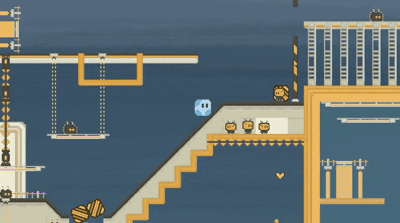

# Project H20

A 2D puzzle-platformer built in Unity where players can switch between three states of matter (Ice, Water, and Gas) to solve physics-based puzzles, navigate obstacles, and complete levels in a retro-industrial world.

🎮 [Play the game on Itch.io](https://tomiot.itch.io/projet-h20)

## Gameplay Overview

In **Project H20**, players take control of a character that can freely switch between the three physical states of water to traverse a puzzle-rich environment:

- **Ice**: Heavy and able to push objects or activate pressure plates. Slides on smooth surfaces.
- **Water**: Can flow through pipes or narrow gaps. Can activate certain levers.
- **Gas**: Floats upwards, can pass through grates, and is affected by wind currents.

Each state is used to interact with different elements of the level such as buttons, platforms, and environmental hazards.

---

## Features

| Feature                    | Description                                                            |
| -------------------------- | ---------------------------------------------------------------------- |
| **State Switching**        | Switch between Ice, Water, and Gas at will                             |
| **Physics-Based Puzzles**  | Use unique properties of each state to solve challenges                |
| **Custom Art & Animation** | Hand-drawn sprites and animations for character states and transitions |
| **Interactive Objects**    | Levers, buttons, pipes, gates, and more                                |
| **Particle Effects**       | Snow, fire, clouds, and steam for atmospheric immersion                |
| **Original Audio**         | Self-made sounds and effects                                           |
| **Multiplayer Mode**       | Supports local multiplayer (2 players)                                 |

---

## Levels

- 6 levels designed around unique combinations of states and mechanics
- Levels take ~2–7 minutes to complete
- Includes a tutorial level to introduce core mechanics
- Features increase in complexity over time

---

> This project was developed purely for educational purposes as part of the Game Engines course (SoSe25).
